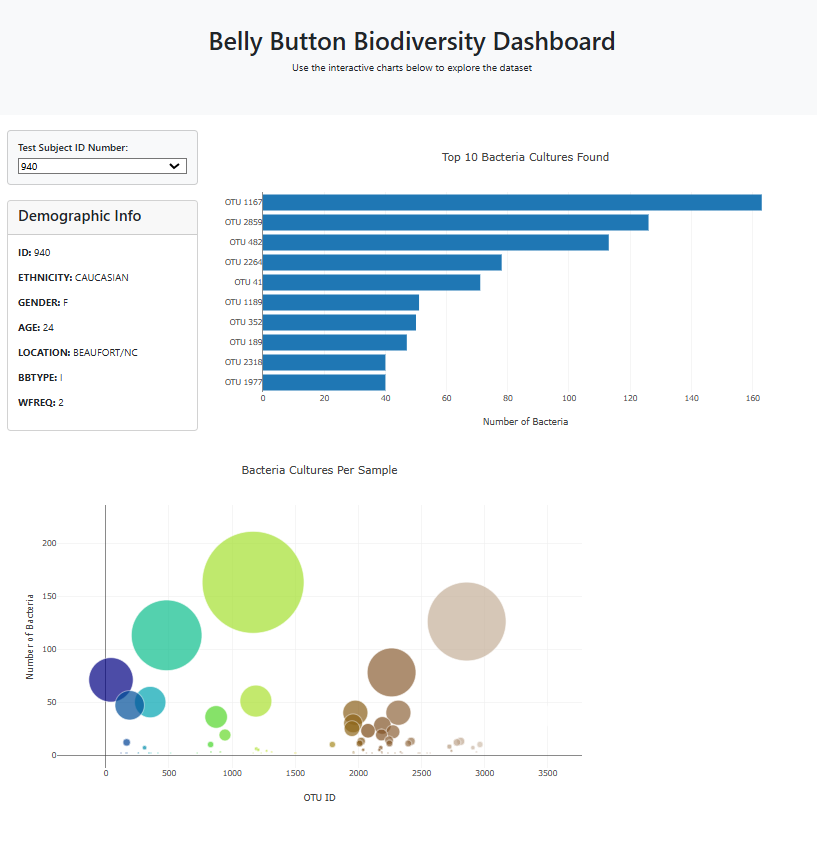

### Belly_Button_Challenge

I built an interactive dashboard using D3.js to visualize microbiome sample data from an external JSON file. The dashboard includes a horizontal bar chart, a bubble chart, and a demographic info panel, all of which update dynamically based on user selection.

# Key Features Implemented:

**Loaded Data Using D3.js**

Used D3 to fetch samples.json from the provided URL.
Extracted sample values, OTU IDs, and OTU labels for visualization.

**Created a Horizontal Bar Chart**

Displayed the top 10 OTUs found in each individual.
Used sample_values for bar lengths, otu_ids for labels, and otu_labels for hovertext.
Implemented a dropdown menu to update the chart when a new sample is selected.

**Created a Bubble Chart**

Plotted each sample with otu_ids on the x-axis and sample_values on the y-axis.
Used sample_values for marker sizes and otu_ids for colors.
Included otu_labels as hovertext for better readability.

**Displayed Metadata (Demographic Information)**

Extracted and displayed metadata for the selected individual.
Looped through key-value pairs in the metadata and dynamically updated the #sample-metadata panel.

**Implemented Dropdown Functionality**

Added an event listener to update all visualizations when a new sample is selected.
Ensured smooth updates across the bar chart, bubble chart, and demographic panel.

**Enhanced Layout & Usability**

Designed a structured and user-friendly dashboard.
Ensured responsive updates to improve interactivity.

